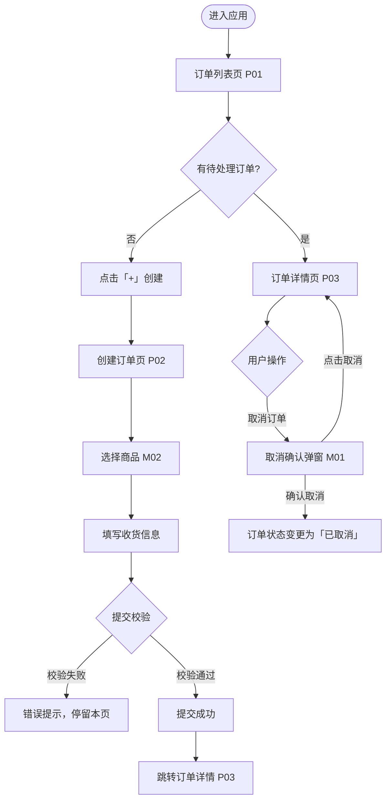

# Lofi Design

在没有设计工具的情况下，用结构化文档产出可评审的低保真交互方案。

## 执行步骤

### 第一步：澄清范围

收到需求后，先输出以下内容请用户确认再继续：

```
1. 涉及几个角色？（普通用户 / 管理员 / 访客）
2. 核心任务流程是什么？（用一句话描述用户要完成什么）
3. 入口页面是哪里？
4. 有无已有页面可以复用？
```

---

### 第二步：产出页面清单

列出本次需求涉及的所有页面/弹窗/状态：

```markdown
## 页面清单

| # | 页面名称 | 类型 | 入口 | 说明 |
|---|----------|------|------|------|
| P01 | 订单列表页 | 主页面 | 底部导航「订单」 | 展示当前用户所有订单 |
| P02 | 创建订单页 | 主页面 | P01 右上角「+」按钮 | 填写订单信息 |
| P03 | 订单详情页 | 主页面 | P01 列表项点击 | 查看订单详情及操作 |
| M01 | 取消订单弹窗 | 弹窗 | P03「取消订单」按钮 | 二次确认 |
| M02 | 选择商品弹窗 | 弹窗 | P02「添加商品」 | 搜索并选择商品 |

**页面总计**：3 个主页面，2 个弹窗
```

---

### 第三步：产出用户流程图

用 Mermaid 语法输出流程图（可在 Markdown 渲染工具中直接查看）：

```markdown
## 用户流程图

### 主流程：创建订单


```

---

### 第四步：产出线框图（ASCII + 文字描述）

每个页面输出一份线框描述，包含 ASCII 草图和元素说明：

````markdown
## 线框图

---

### P01 订单列表页

```
┌─────────────────────────────┐
│  订单管理              [+]  │  ← 顶部导航栏，右侧新建按钮
├─────────────────────────────┤
│  [全部] [待支付] [已完成]   │  ← Tab 筛选栏
├─────────────────────────────┤
│  🔍 搜索订单号/商品名       │  ← 搜索框
├─────────────────────────────┤
│  ┌───────────────────────┐  │
│  │ 订单 #20240315001     │  │  ← 订单卡片
│  │ 商品A × 2 + 商品B × 1 │  │
│  │ ¥ 299.00   [待支付]   │  │
│  │ 2024-03-15 10:23      │  │
│  └───────────────────────┘  │
│  ┌───────────────────────┐  │
│  │ 订单 #20240314008     │  │
│  │ 商品C × 3             │  │
│  │ ¥ 150.00   [已完成]   │  │
│  └───────────────────────┘  │
│           加载更多           │
└─────────────────────────────┘
```

**元素说明**：
- 顶部导航：页面标题 + 右侧新建按钮（图标）
- Tab 筛选：全部 / 待支付 / 待发货 / 已完成 / 已取消，默认选中「全部」
- 搜索框：支持订单号、商品名模糊搜索
- 订单卡片：点击整张卡片跳转 P03，显示订单号、商品摘要、总金额、状态标签、创建时间
- 列表：下拉加载更多，初始加载 20 条

**空状态**：无订单时显示插画 + 「暂无订单，去创建一个吧」+ 「立即创建」按钮

---

### P02 创建订单页

```
┌─────────────────────────────┐
│  ← 创建订单                 │  ← 顶部返回导航
├─────────────────────────────┤
│  商品信息                   │
│  ┌───────────────────────┐  │
│  │ + 添加商品             │  │  ← 点击打开 M02
│  └───────────────────────┘  │
│  ┌───────────────────────┐  │
│  │ 商品A       × [−][2][+]│  │  ← 已选商品行
│  │ ¥ 99.00/件  小计¥198  │  │
│  └───────────────────────┘  │
├─────────────────────────────┤
│  收货信息                   │
│  收货人  [________________] │
│  手机号  [________________] │
│  地址    [________________] │
│          [________________] │
├─────────────────────────────┤
│  备注    [________________] │
├─────────────────────────────┤
│  合计：¥ 198.00             │
│  ┌───────────────────────┐  │
│  │       提交订单         │  │  ← 主操作按钮
│  └───────────────────────┘  │
└─────────────────────────────┘
```

**元素说明**：
- 商品区域：可添加多个商品，每行支持数量加减，最少 1 件
- 收货信息：收货人、手机号必填；地址必填
- 提交按钮：未选商品时置灰不可点；校验失败时对应字段下方显示错误文案

---

### M01 取消订单弹窗

```
┌─────────────────────────────┐
│                             │
│     确认取消该订单？         │
│                             │
│  取消后订单将无法恢复，      │
│  已扣库存将自动归还。        │
│                             │
│  ┌──────────┐ ┌──────────┐ │
│  │  再想想  │ │  确认取消 │ │
│  └──────────┘ └──────────┘ │
└─────────────────────────────┘
```

**元素说明**：
- 「再想想」关闭弹窗，订单状态不变
- 「确认取消」调接口，成功后弹窗关闭，订单状态变更，Toast 提示「订单已取消」
````

---

### 第五步：产出交互说明文档

````markdown
## 交互说明

### 通用规则

| 规则 | 说明 |
|------|------|
| 加载状态 | 所有接口调用期间，操作按钮 loading 态，防止重复提交 |
| 网络错误 | 接口失败统一 Toast 提示「网络异常，请稍后重试」 |
| 返回逻辑 | 表单页有未保存内容时，返回弹二次确认「是否放弃编辑？」 |
| 空状态 | 所有列表页必须设计空状态，见各页面说明 |

### P01 订单列表页

| 交互场景 | 行为 |
|----------|------|
| 下拉刷新 | 重新请求第一页数据 |
| 滚动到底部 | 加载下一页，无更多数据时显示「已加载全部」 |
| Tab 切换 | 重新请求对应状态的列表，保留搜索关键词 |
| 搜索输入 | 防抖 300ms 后触发搜索，清空时恢复完整列表 |

### P02 创建订单页

| 交互场景 | 行为 |
|----------|------|
| 商品数量为 0 | 自动从列表移除该商品 |
| 提交时校验失败 | 第一个错误字段自动获取焦点，错误文案显示在字段下方 |
| 提交成功 | 跳转 P03 订单详情页，返回栈清除 P02 |
| 提交中点击返回 | 拦截返回，提示「订单提交中，请稍候」 |
````

---

## 输出完整度检查

产出低保真文档后，逐项检查：

- [ ] 页面清单已列出所有页面和弹窗
- [ ] 用户流程图覆盖主流程和关键分支
- [ ] 每个页面都有线框图和元素说明
- [ ] 每个页面都有**空状态**设计
- [ ] 列表页有加载更多 / 分页方案
- [ ] 表单页有校验规则说明
- [ ] 弹窗有取消和确认两种结果的说明
- [ ] 通用交互规则已定义（加载、报错、返回）
- [ ] 标注了哪些字段/操作需要权限控制
